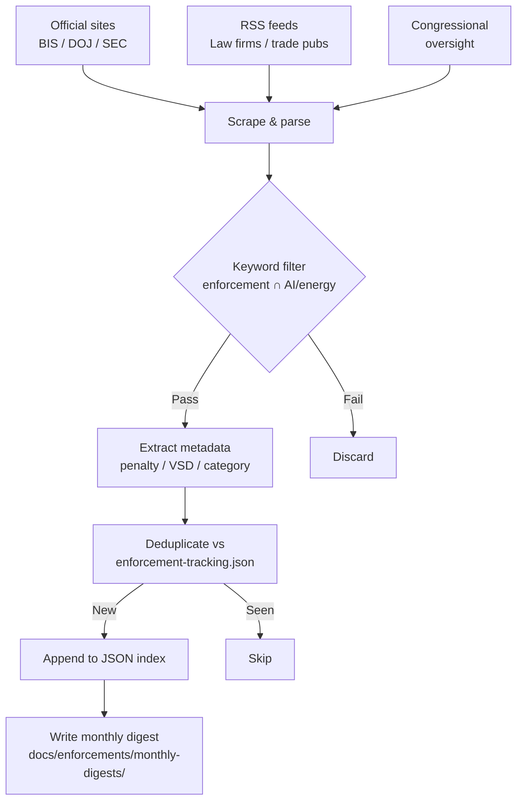

# Enforcement Ingestion Workflow

*Methodology, data sources, and operational notes for the monthly enforcement scanner (`scripts/regwatch.py`).*

---

## Overview

The enforcement scanner (`regwatch.py`) runs monthly on the 1st of each month via `.github/workflows/enforcement-monthly.yml`. It scrapes official enforcement sources and law firm commentary, applies dual keyword filters, deduplicates against a persistent JSON index, and writes a structured monthly digest.

---

## Data Sources

### Official enforcement sources

| Source | URL | Items scraped |
|---|---|---|
| BIS Charging Letters | `https://www.bis.gov/enforcement/charging-letters` | Enforcement charging letters |
| BIS Settlements | `https://www.bis.gov/enforcement/settlements` | Settlement agreements |
| BIS Denial Orders | `https://www.bis.gov/enforcement/denial-orders` | Active denial orders |
| DOJ-NSD Press Releases | `https://www.justice.gov/nsd/press-releases` | Criminal indictments and pleas |
| SEC Litigation Releases (RSS) | `https://www.sec.gov/rss/litigation/litreleases.htm` | SEC enforcement (knowledge-doctrine proxy) |

### Law firm RSS feeds

| Firm | Feed | Category |
|---|---|---|
| Steptoe Int'l Compliance | `steptoeinternationallawblog.com/feed/` | Law Firm Analysis |
| Gibson Dunn | `gibsondunn.com/feed/` | Law Firm Analysis |
| White & Case | `whitecase.com/feed/` | Law Firm Analysis |
| Paul Hastings | `paulhastings.com/feed/` | Law Firm Analysis |
| Cleary Gottlieb | `clearygottlieb.com/rss/` | Law Firm Analysis |
| WilmerHale | `wilmerhale.com/en/insights/rss` | Law Firm Analysis |
| Covington | `cov.com/en/news-and-insights/rss` | Law Firm Analysis |
| Baker McKenzie Sanctions | `sanctionsnews.bakermckenzie.com/feed/` | Law Firm Analysis |
| Akin Gump | `akingump.com/feed/` | Law Firm Analysis |

### Trade publications

| Source | Feed | Category |
|---|---|---|
| WorldECR | `worldecr.com/feed/` | Trade & Industry |
| Trade Compliance Corner | `tradecompliancecorner.com/feed/` | Trade & Industry |

### Congressional oversight

| Source | URL | Notes |
|---|---|---|
| Senate PSI | `hsgac.senate.gov/subcommittees/investigations/` | Permanent Subcommittee on Investigations |
| Senate Commerce Committee | `commerce.senate.gov/press-releases` | Commerce/technology oversight |

---

## Keyword Filters

Items must pass **at least one** keyword from each list to be ingested.

### Enforcement doctrine terms

```
high probability awareness    knowledge standard         de minimis
substantial transformation    entity-shifting            entity shifting
catch-all provision           General Prohibition 10     inchoate provisions
charging letter               voluntary self-disclosure   VSD
civil penalty                 denial order               temporary denial order
TDO                           export violation           unlicensed export
willful violation             willfully                  aiding and abetting
evasion                       transshipment              shell company
end-user certificate          false statement            settlement agreement
deferred prosecution          plea agreement             is informed
knew or should have known     reason to know             red flag
15 CFR                        50 U.S.C.                  ECRA
EAR violation                 OFAC enforcement           BIS enforcement
```

### AI / energy / semiconductor terms

```
semiconductor     CCUS              AI                artificial intelligence
compute           data center       GPU               chip
LNG               nuclear           rare earth        gallium
germanium         graphite          model weight      accelerator
H100              A100              H800              NVIDIA
Huawei            SMIC              advanced computing wafer fabrication
EDA software      lithography       ASML              3A090
4A090             Entity List       military end user  MEU List
```

---

## Processing Pipeline



---

## Output Files

### `docs/enforcements/enforcement-tracking.json`

Persistent JSON index of all ingested enforcement items. Schema:

| Field | Type | Description |
|---|---|---|
| `case_id` | string | `{regulator}-{year}-{sequence}` |
| `regulator` | string | `BIS`, `DOJ-NSD`, `OFAC`, `BIS+DOJ` |
| `respondent` | string | Entity/individual name as published |
| `date` | string | ISO 8601 date |
| `category` | string | `gpu-smuggling`, `semiconductor-manufacturing`, `subsidiary-entity-shifting`, `other` |
| `controlled_items` | string | ECCN or item description |
| `destination` | string | Destination country/end-user |
| `charges` | array | 15 CFR § 764.2 provisions or criminal statutes |
| `knowledge_standard` | string | `positive`, `high-probability`, `willful-blindness`, `willful` |
| `resolution` | string | `charging-letter`, `civil-penalty`, `plea`, `tdo`, `denial-order`, `compliance-order` |
| `penalty_usd` | integer\|null | Civil penalty in USD |
| `notes` | string | Free-text notes on significant legal issues |

### `docs/enforcements/monthly-digests/digest-YYYY-MM.md`

Monthly markdown digest with:
- Summary statistics table (total items, by regulator, by category)
- Per-category item lists with title, source, URL, and penalty amount where available

---

## Running Manually

```bash
# Install dependencies
pip install requests beautifulsoup4 lxml feedparser

# Run scanner
python scripts/regwatch.py
```

The script respects a 30-day look-back window by default and deduplicates against the existing JSON index.

---

## Update Cadence

| Component | Cadence | Trigger |
|---|---|---|
| `enforcement-tracking.json` | Monthly | 1st of month, 08:00 UTC |
| Monthly digest files | Monthly | Same run |
| Daily digest (cross-reference) | Daily | `daily-update.yml` at 07:00 UTC |

---

## Limitations

- RSS feed availability varies by firm; some may block automated access intermittently.
- SEC litigation releases are included as a "knowledge-doctrine proxy" — SEC enforcement often surfaces parallel export-control knowledge arguments but is not a primary EAR/OFAC source.
- Congressional oversight pages are scraped for hearing announcements and report publications, not full transcripts.
- The scanner captures publicly available summaries, not full charging letter or indictment text.

---

*Informational only; not legal advice.*
