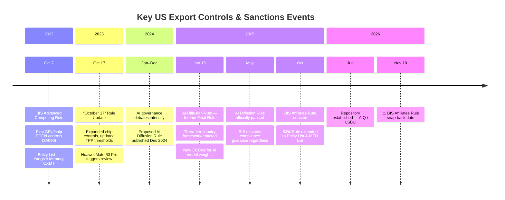
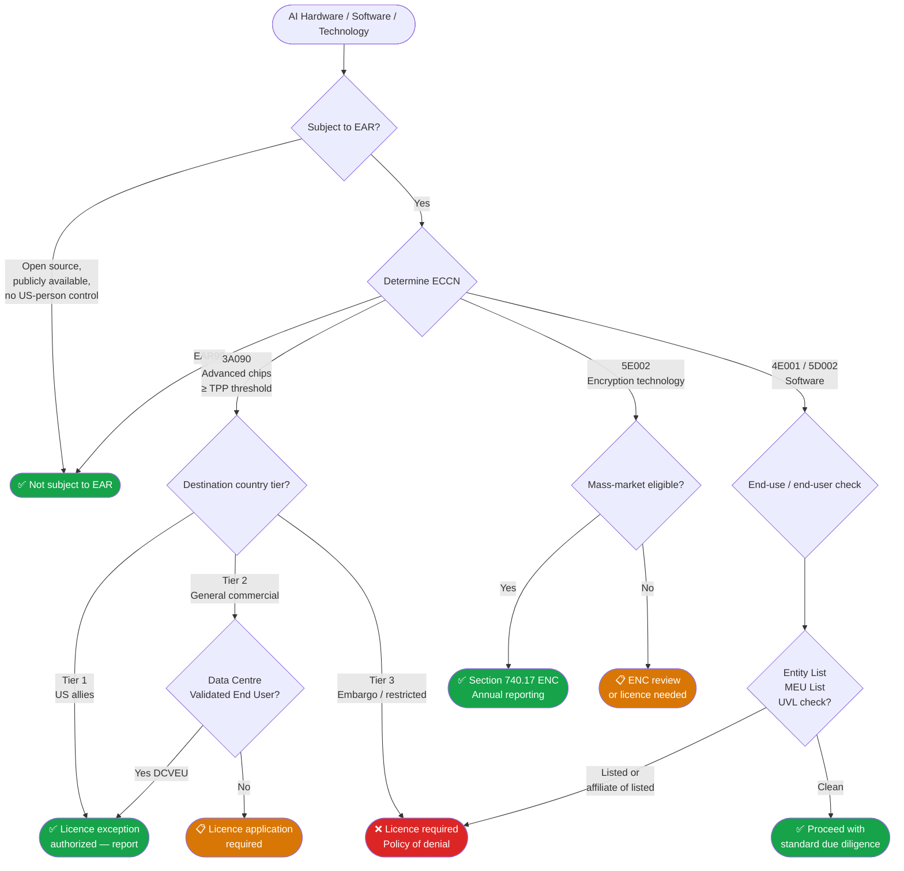
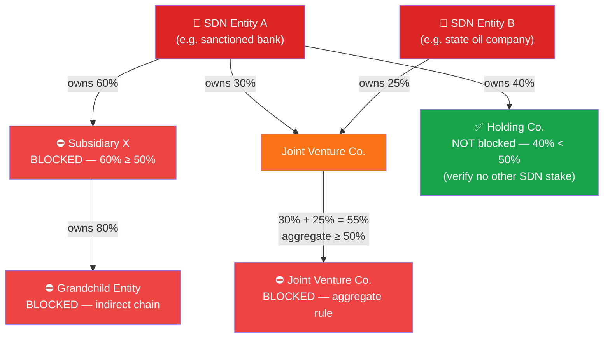
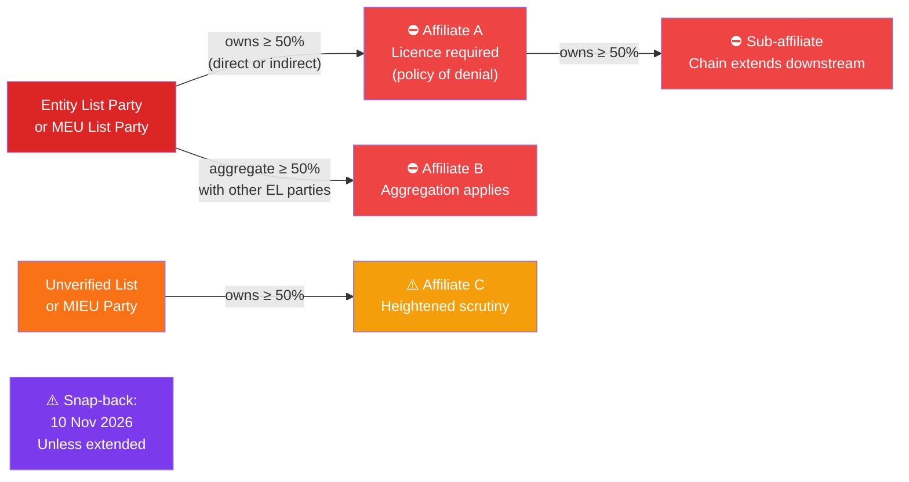
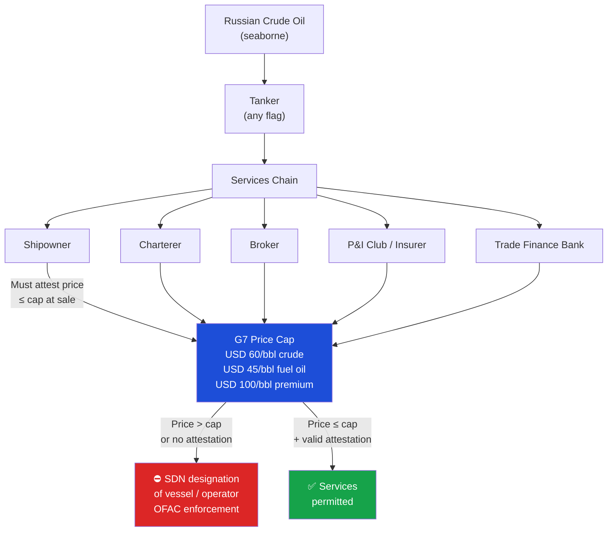

# Regulatory Visuals & Decision Tools

Interactive diagrams for navigating US export controls and sanctions frameworks. All diagrams are rendered in-browser via Mermaid.

---

## Regulatory Timeline: AI & Energy Sanctions (2022–2026)

---

## AI Hardware Export: Compliance Decision Tree

---

## OFAC 50% Rule: Ownership Aggregation Chains

The diagram below illustrates how SDN restrictions flow through ownership structures — including cases where no single SDN holds ≥ 50% alone.

> **Key rule:** Aggregation applies even where no single SDN holds ≥ 50% alone. Always trace full ownership chains and add up all SDN-held stakes. See [OFAC FAQ 1521](./regulations/ofac-ubo-50-percent-rule.md).

---

## BIS Affiliates Rule: Scope Diagram

---

## Russian Oil Price Cap: Compliance Chain

---

*Diagrams rendered with [Mermaid](https://mermaid.js.org/). Source: `docs/visuals.md`.*
